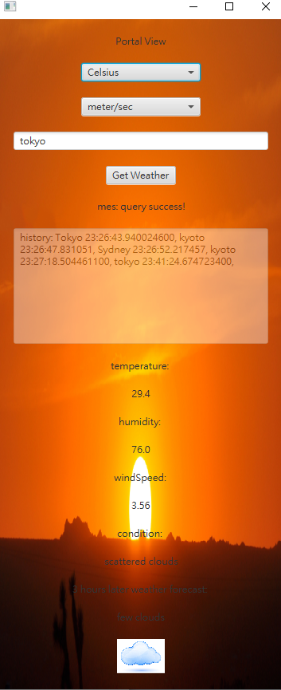
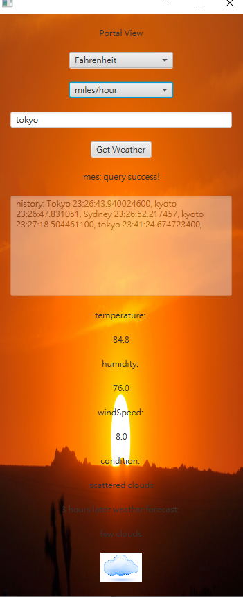

# a.how to use the Weather Information App
  Install JDK 17.0 from Oracle
    Following https://code.visualstudio.com/docs/java/java-gui to create project and get
    pom.xml file
  Install apache-maven-3.9.6 and assign path
  Compile & Running the program:
    1.Open PowerShell from windows
    2.Change path to target foler:
    cd C:\xxx\week
    run "C:\Program Files\apache-maven-3.9.6\bin\mvn.cmd" javafx:run -f
    "c:\yourPath\a1\pom.xml"

  Interacting with GUI
    Click when use button, text field, dropdown.
    Close program by top-right ‘X’ button.

  Get weather info
    input city name (case-insensitive)
    click button [Get weather]

# b.details about your implementation. 

  UI: use JavaFX
  API: use openweathermap.org
  JSON parser: org.json
  Icon: use local image
  Unit converter: use comboBox to choose after each weather query. it auto reset when click query weather.
  History Tracking: use textarea and variable to log input
  Dynamic Backgrounds: use machine local time to check day or night. then show image

  

  

